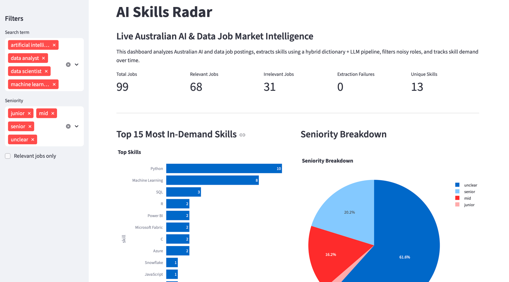
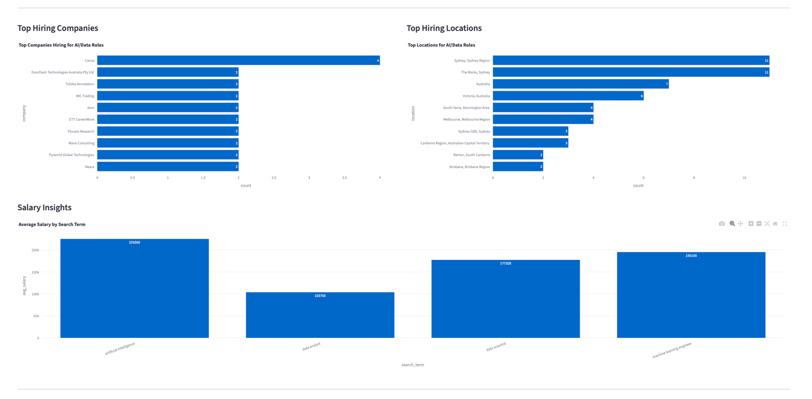
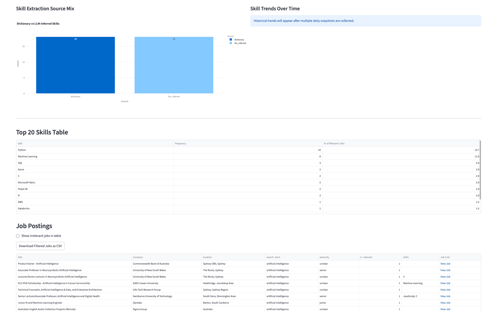

# AI Skills Radar

> An end-to-end AI job market intelligence platform that analyzes live Australian AI & Data job postings to identify in-demand skills, hiring trends, salary insights, and market demand.

---

## 📖 Overview

AI Skills Radar automatically collects live Australian AI and Data job postings, extracts technical skills using a hybrid **Dictionary + Local LLM** pipeline, filters irrelevant jobs, and presents interactive market intelligence through a Streamlit dashboard.

The project answers questions such as:

- Which AI skills are currently most in demand?
- Which companies are hiring the most?
- Which cities have the highest demand?
- What salaries are employers offering?
- How do skill trends change over time?

---

# 📷 Dashboard Preview

## Dashboard Overview



---

## Market Intelligence



---

## Skills & Job Explorer



---

# Key Features

- Collects live Australian AI & Data job postings using the Adzuna Jobs API. 
- Extracts technical skills using a hybrid Dictionary + Local LLM (Qwen via Ollama) pipeline.
- Classifies job relevance to separate technical AI/Data roles from unrelated postings.
- Detects seniority levels (Junior, Mid, Senior).
- Interactive Streamlit dashboard with real-time analytics.
- Salary analysis by job category.
- Hiring company and employer insights.
- Hiring location analysis across Australia.
- Historical skill trend tracking through daily snapshots.
- Export filtered job listings as CSV.

---

## Tech Stack

| Category | Technologies |
|-----------|--------------|
| Programming Language | Python 3 |
| Data Processing | Pandas |
| Database | SQLite |
| Data Visualization | Plotly |
| Dashboard | Streamlit |
| Local LLM | Ollama (Qwen 2.5 7B) |
| Job Data Source | Adzuna Jobs API |
| Version Control | Git, GitHub |

---

## Project Architecture

```text
                    Adzuna Jobs API
                           │
                           ▼
                  fetch_jobs.py
                           │
                           ▼
                    SQLite Database
                           │
            ┌──────────────┴──────────────┐
            │                             │
            ▼                             ▼
     extract_skills.py          save_snapshot.py
 (Dictionary + Local LLM)    Historical Skill Tracking
            │
            ▼
       analytics.py
            │
            ▼
      Streamlit Dashboard
```

---

## Data Pipeline

1. Fetch live AI and Data job postings from the Adzuna Jobs API.
2. Store raw job postings in a SQLite database.
3. Match explicit technical skills using a curated dictionary.
4. Use a local Qwen 2.5 model through Ollama to identify additional technical skills, classify seniority, and determine role relevance.
5. Merge and normalize dictionary- and LLM-extracted skills.
6. Save processed results back to the database.
7. Generate daily historical skill snapshots.
8. Visualize hiring trends and market insights through an interactive Streamlit dashboard.

---

## Project Structure

```text
ai-skills-radar/
│
├── app.py                     # Streamlit dashboard
├── analytics.py               # Dashboard analytics
├── extract_skills.py          # Hybrid skill extraction
├── fetch_jobs.py              # Job collection from Adzuna
├── save_snapshot.py           # Historical skill snapshots
├── fix_existing_unclear.py    # Retry extraction for previous failures
├── reextract_empty_skills.py  # Reprocess empty skill rows
├── job_postings.db            # SQLite database
├── screenshots/
├── requirements.txt
├── .env.example
└── README.md
```

---

## Installation

Clone the repository:

```bash
git clone https://github.com/<your-github-username>/ai-skills-radar.git
cd ai-skills-radar
```

Create a virtual environment:

```bash
python -m venv venv
```

Activate the environment:

**Windows**

```bash
venv\Scripts\activate
```

**macOS / Linux**

```bash
source venv/bin/activate
```

Install the required packages:

```bash
pip install -r requirements.txt
```

---

## Environment Variables

Create a `.env` file in the project root.

```env
ADZUNA_APP_ID=your_app_id
ADZUNA_APP_KEY=your_app_key
```

The project uses the Adzuna Jobs API to fetch live Australian AI and Data job postings.

---

## Running the Project

### 1. Fetch live job postings

```bash
python fetch_jobs.py
```

### 2. Extract skills and classify jobs

```bash
python extract_skills.py
```

### 3. Save a daily skill snapshot

```bash
python save_snapshot.py
```

### 4. Launch the dashboard

```bash
streamlit run app.py
```

---

## Dashboard Features

The interactive Streamlit dashboard provides:

- AI and Data job market overview
- Top in-demand technical skills
- Seniority distribution
- Relevant vs. irrelevant role analysis
- Hiring company insights
- Hiring location insights
- Salary analysis by job category
- Skill extraction source breakdown (Dictionary vs. LLM)
- Historical skill trend tracking
- Downloadable filtered job listings

---

## Challenges & Solutions

| Challenge | Solution |
|-----------|----------|
| LLM responses occasionally contained malformed JSON | Implemented automatic retry logic and fallback handling for failed extractions. |
| Duplicate skills from dictionary and LLM extraction | Added normalization, alias mapping, and deduplication before storing results. |
| Generic AI terms reduced dashboard quality | Introduced skill validation and filtering to retain only meaningful technical skills. |
| Non-technical roles appeared in search results | Added LLM-based relevance classification to separate AI/Data roles from unrelated jobs. |
| Tracking market trends over time | Implemented daily SQLite snapshots to capture historical skill demand. |

---

## Future Improvements

- Deploy the dashboard using Streamlit Community Cloud.
- Automate daily job collection and snapshot creation.
- Support multiple countries and job markets.
- Add semantic skill clustering using embeddings.
- Forecast future skill demand trends.
- Generate downloadable PDF reports.
- Integrate additional job providers beyond Adzuna.

---

## License

This project was developed for educational and portfolio purposes.

---